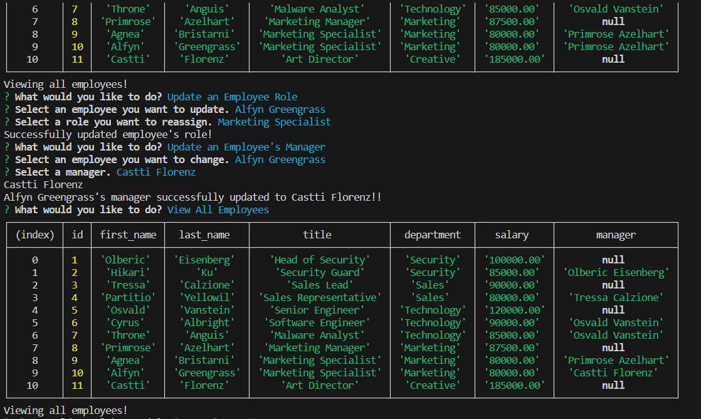

# Employee Tracker

## Description
This project utilizes databases to keep track of the user's departments, roles, and employees.

## Usage

This project runs on Node.js. Running "node index.js" will start the application by asking the user a series of questions. The user can view departments, roles, and employees, and also add new ones. The user can also reassign managers or roles for a selected employee. Additionally, the user can also view employees by department. When adding a role, the user can type a title, the salary, and the department in which it belongs to. When adding a new employee, the user can add their first and last name, their given role, and assign a manager to that employee.

## Walkthrough Video

https://drive.google.com/file/d/1yN9twqNnTSQJVHCxiEZVx2IihGuptrf9/view?usp=sharing